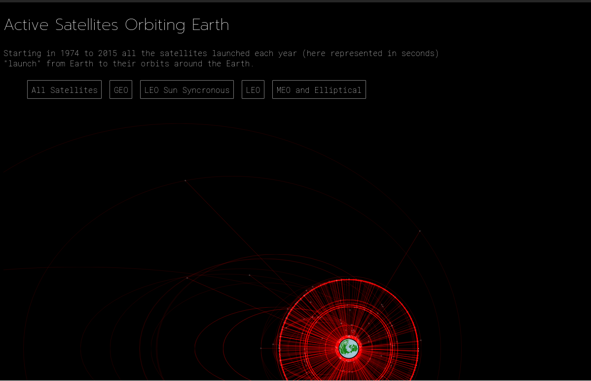

## Active Satellites orbiting earth!
One of my first projects; I cleaned and calculated the orbital paths of all the active satellites orbiting earth derived from their basic oribtal features of period, apogee, perigee, etc.
 
(ianssmith.github.io/Satellite_Map)

